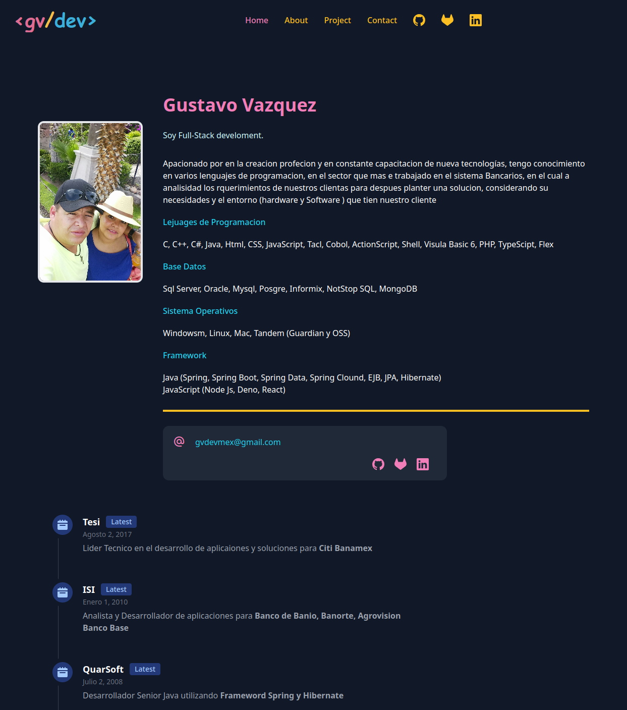

# gvdevmex-web

Esta es una pagina personal para aprender Astro, React y ayudar a la comunidad
agregando Post recompilando la informacion de diferente tecnologias que nos
permita creear mejores aplicaciones, este pagina esta hecha para aquellos que
les apacione el mundo de desarrollo ya se va esta publicando temas de diferentes
lenjuages de programacion entre

> C/C++
> Cobol
> Java con diferente Framework
> Node Js
> Deno
> Etc.

